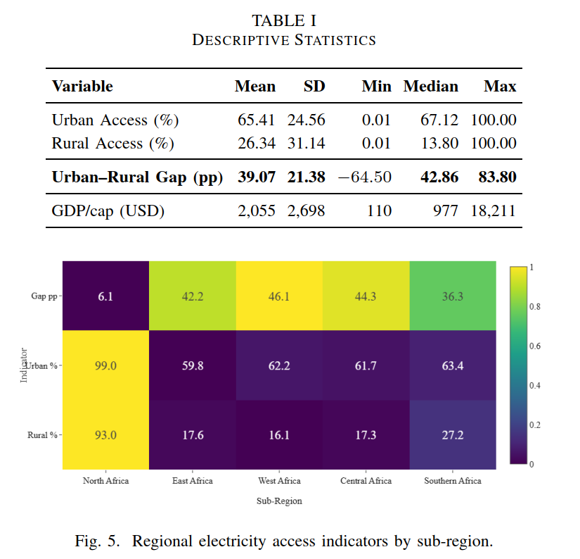
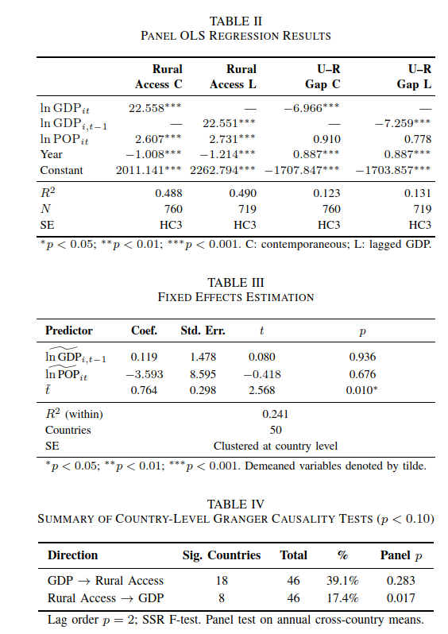

<!-- ===== HEADER BANNER ===== -->

# The Resource–Access Paradox: Electricity, Inequality, and Rural Exclusion in Africa

**Frédéric Mirindi**  &nbsp;&middot;&nbsp;  **Derrick Mirindi**  &nbsp;&middot;&nbsp;  **David Sinkhonde**

  
  
  
  

[**← Back to Profile**](../README.md)

---

## 📄 Abstract

> Africa's electricity challenge extends beyond power generation. It also requires reliable delivery to rural households. This study examines the *Resource–Access Paradox*. The paradox arises when national electricity generation does not produce equitable rural electrification. The study draws on a balanced panel of 51 African countries from 2000 to 2016 (N = 782 country-year observations). It combines panel regressions, Granger causality tests, and convergence analysis. In addition, Principal Component Analysis (PCA), Autoregressive Integrated Moving Average (ARIMA) forecasts, and ensemble machine-learning models extend the analysis. The results reveal a persistent 39.1 percentage-point urban–rural access gap and σ-convergence without β-convergence. This pattern implies no finite rural catch-up half-life within the 2030 Sustainable Development Goal 7 (SDG 7) horizon. PCA demonstrates that high national electrification does not necessarily imply equitable rural access; the two outcomes form distinct dimensions. The Granger tests suggest that income better predicts future rural-access gains than rural access predicts income. Moreover, ARIMA forecasts place 2024 rural access at only 38.3%, and ensemble models identify electricity output as the strongest predictor of rural electrification. The findings outline the need for rural-targeted electrification strategies, stronger governance, and decentralized energy solutions across sub-Saharan Africa.

---

## 📊 Figure 1 — Descriptive Statistics & Regional Access Indicators

  

<em>Fig. 1. Descriptive statistics of urban access, rural access, urban–rural gap, and GDP per capita, alongside a heatmap of regional electricity access indicators (gap, urban %, rural %) across African sub-regions.</em>

---

## 📈 Figure 2 — Regression, Fixed Effects & Granger Causality Results

  

<em>Fig. 2. Panel OLS regression results, fixed effects estimation, and a summary of country-level Granger causality tests linking GDP and rural electricity access.</em>

---

## 📌 Key Findings

|   |   |
|---|---|
| Finding | Description |
| ⚡ **Persistent access gap** | A 39.1 percentage-point urban–rural electricity access gap across 51 African countries |
| 📉 **Convergence pattern** | σ-convergence without β-convergence — no finite rural catch-up half-life before SDG 7 (2030) |
| 🧩 **Distinct dimensions** | PCA shows national electrification and equitable rural access form separate dimensions |
| 🔁 **Causality direction** | Granger tests suggest income predicts rural-access gains more than the reverse |
| 🔮 **Forecast** | ARIMA places 2024 rural access at only 38.3% |
| 🌐 **Policy implication** | Need for rural-targeted electrification, stronger governance, and decentralized energy |

---

## 📚 Citation

> F. Mirindi, D. Mirindi, and D. Sinkhonde, "The Resource–Access Paradox: Electricity, Inequality, and Rural Exclusion in Africa," in **IEEE I&CPS Asia 2026**, IEEE, 2026.

[**← Back to Profile**](../README.md)

