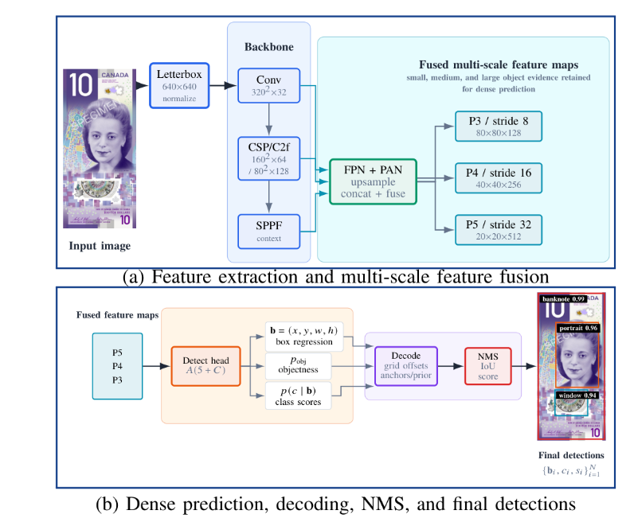
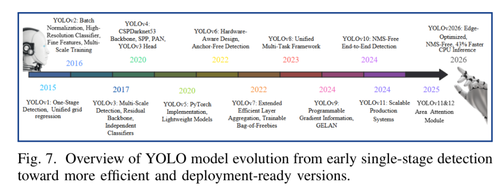

<!-- ===== HEADER BANNER ===== -->

# An Overview of the Evolution of the YOLO Algorithm

**Frédéric Mirindi** &nbsp;&middot;&nbsp; **Derrick Mirindi** &nbsp;&middot;&nbsp; **David Sinkhonde**

  
  
  
  

[**&#8592; Back to Profile**](../README.md)

---

## 📄 Abstract

> Object detection is a central task in artificial intelligence, and You Only Look Once (YOLO) remains one of its most influential one-stage detection frameworks. This paper reviews the evolution of YOLO from YOLOv1 through YOLO26. It emphasizes the technical mechanisms that distinguish successive versions, such as backbone design, neck-based feature fusion, detection-head formulation, anchor-based and anchor-free prediction, label assignment, loss functions, postprocess design, and deployment optimization. It also summarizes key mathematical concepts used in YOLO detection. These concepts cover bounding-box prediction, confidence scores, intersection-over-union metrics, non-maximum suppression, and class-imbalance treatment. In addition, the paper presents a bibliometric assessment based on Dimensions.ai and VOSviewer. This assessment identifies growth across major research fields, institutional collaboration networks, and country-level publication patterns. Overall, the review highlights how YOLO methods have expanded from single-task object detection toward segmentation, pose estimation, oriented bounding boxes, tracking, and edge inference.

---

## 🧩 Figure 1 &mdash; Detection Pipeline

  

<em>Fig. 1. (a) Feature extraction and multi-scale feature fusion via backbone (Conv, CSP/C2f, SPPF) and FPN + PAN neck producing P3/P4/P5 feature maps. (b) Dense prediction, decoding, non-maximum suppression (NMS), and final detections.</em>

---

## 🗓️ Figure 2 &mdash; Model Evolution Timeline

  

<em>Fig. 2. Overview of YOLO model evolution from early single-stage detection toward more efficient and deployment-ready versions.</em>

---

## 📌 Key Themes

| Theme | Description |
| :--- | :--- |
| 🏗️ **Backbone design** | Feature extractors from Darknet to CSP/C2f blocks |
| 🔗 **Neck / feature fusion** | FPN + PAN multi-scale aggregation |
| 🎯 **Detection head** | Anchor-based vs. anchor-free prediction |
| 🧠 **Label assignment** | Static and dynamic matching strategies |
| 📉 **Loss functions** | Box regression, objectness, and classification objectives |
| ⚡ **Deployment** | NMS-free, edge-optimized, and CPU-efficient inference |

---

## 📚 Citation

> F. Mirindi, D. Mirindi, and D. Sinkhonde, *"An Overview of the Evolution of the YOLO Algorithm,"* in **2026 IEEE 3rd International Conference on Computer Vision and Deep Learning (DLCV)**, IEEE, 2026.

[**&#8592; Back to Profile**](../README.md)

